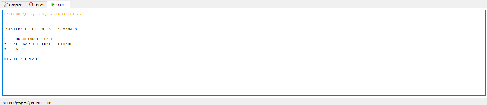
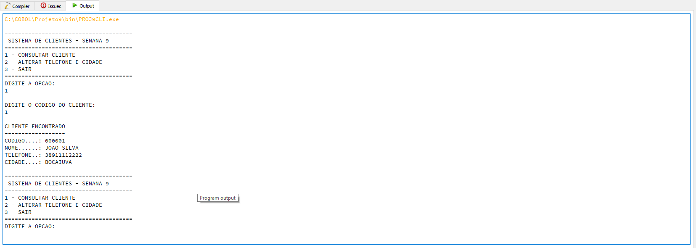
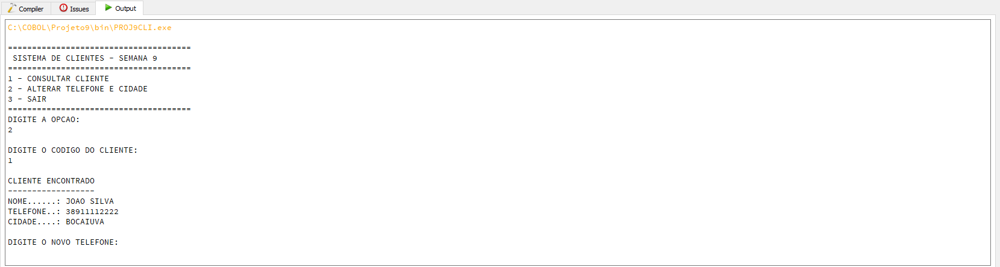
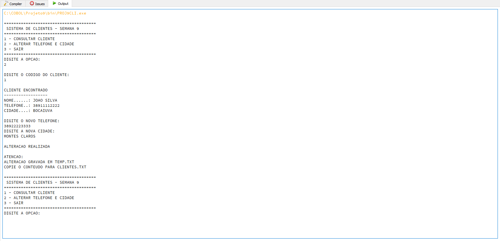
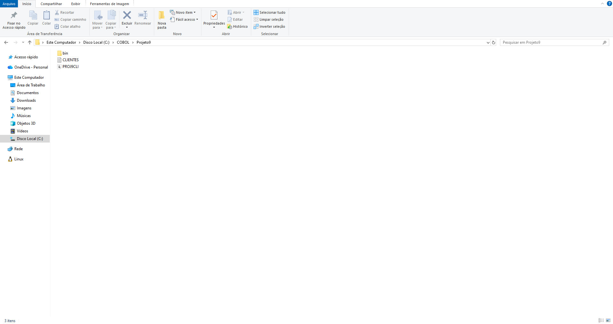
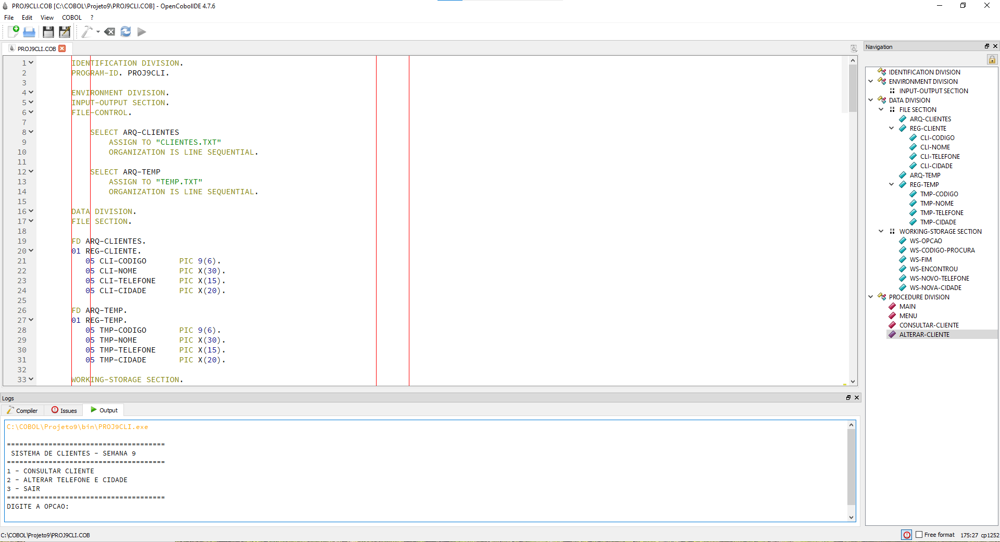
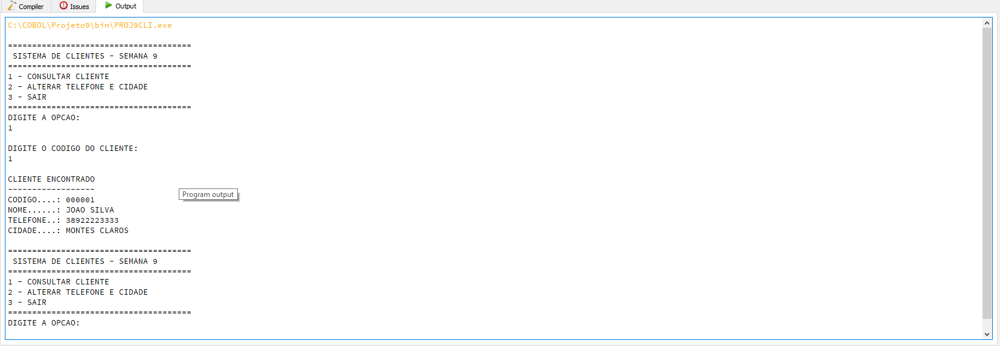

<div align="center">

# 🖥️ Sistema de Consulta e Atualização de Clientes em COBOL

### Projeto desenvolvido em COBOL utilizando OpenCobolIDE para simular operações de consulta e atualização de clientes em arquivos sequenciais.


</div>

---

# 📖 Sobre o Projeto

Este projeto foi desenvolvido durante a **Semana 9** do **Programa Acelera Maker Montreal**, com o objetivo de praticar programação em **COBOL** utilizando o **OpenCobolIDE**.

O sistema simula um pequeno cadastro de clientes permitindo:

- 🔍 Consultar clientes
- 📞 Alterar telefone
- 🏙️ Alterar cidade
- 💾 Gravar alterações em arquivo temporário

Embora executado no OpenCobolIDE, o projeto foi estruturado utilizando conceitos presentes em aplicações **Mainframe**, como processamento sequencial de arquivos e simulação de atualização de registros.

---

# 👨‍💻 Autor

**Andrey Dias Ferreira**

Projeto desenvolvido para fins acadêmicos e prática em desenvolvimento Mainframe.

---

# 🎯 Objetivos

- Desenvolver aplicações em COBOL
- Manipular arquivos sequenciais
- Simular atualização de registros
- Organizar programas em divisões COBOL
- Praticar lógica de programação
- Aplicar conceitos utilizados em ambientes Mainframe

---

# 🚀 Tecnologias Utilizadas

| Tecnologia | Descrição |
|------------|-----------|
| COBOL | Linguagem principal |
| GnuCOBOL | Compilador |
| OpenCobolIDE | Ambiente de Desenvolvimento |
| Arquivos Texto | Persistência de dados |
| Git | Controle de versão |
| GitHub | Hospedagem do projeto |

---

# 📂 Estrutura do Projeto

```text
Projeto-Semana9-COBOL
│
├── README.md
├── PROJ9CLI.COB
├── CLIENTES.txt
├── TEMP.TXT
│
└── prints
    ├── print01-menu-principal.png
    ├── print02-consulta-cliente.png
    ├── print03-alteracao-cliente.png
    ├── print04-alteracao-realizada.png
    ├── print05-estrutura-projeto.png
    ├── print06-codigo-cobol.png
    └── print07-consulta-atualizada.png
```

---

# ⚙️ Funcionalidades

✅ Consulta de Cliente

✅ Alteração de Telefone

✅ Alteração de Cidade

✅ Atualização de Arquivo Temporário

✅ Simulação de Persistência de Dados

---

# 🔄 Fluxo do Sistema

```text
                INÍCIO
                   │
                   ▼
           Menu Principal
                   │
      ┌────────────┴────────────┐
      ▼                         ▼
Consultar Cliente        Alterar Cliente
      │                         │
      ▼                         ▼
Ler Arquivo CLIENTES      Atualizar Dados
      │                         │
      └────────────┬────────────┘
                   ▼
           Exibir Resultado
                   │
                   ▼
                  FIM
```

---

# 📸 Demonstração

## 🏠 Menu Principal

Tela inicial do sistema.



---

## 🔎 Consulta de Cliente

Consulta realizada pelo código do cliente.



---

## ✏️ Alteração de Cliente

Atualização de telefone e cidade.



---

## ✅ Alteração Concluída

Mensagem informando que a alteração foi gravada.



---

## 📁 Estrutura do Projeto

Arquivos utilizados no desenvolvimento.



---

## 💻 Código COBOL

Trecho do código desenvolvido.



---

## ✔ Consulta Após Atualização

Validação da alteração realizada.



---

# ▶️ Como Executar

1. Instale o **OpenCobolIDE**.

2. Abra o arquivo:

```
PROJ9CLI.COB
```

3. Certifique-se de que o arquivo:

```
CLIENTES.txt
```

esteja na mesma pasta do executável.

4. Compile o programa.

5. Execute normalmente.

---

# 📚 Conceitos Aplicados

- Manipulação de Arquivos
- READ
- WRITE
- OPEN
- CLOSE
- Estruturas IF
- PERFORM
- Organização das Divisions COBOL
- Simulação de atualização de registros

---

# 📈 Melhorias Futuras

- Cadastro de novos clientes
- Exclusão de clientes
- Pesquisa por nome
- Integração com banco de dados
- Interface CICS/BMS
- VSAM

---

# 📝 Licença

Projeto desenvolvido exclusivamente para fins educacionais.

---

<div align="center">

# ⭐ Obrigado por visitar este projeto!

Caso tenha gostado, deixe uma ⭐ no repositório.

</div>